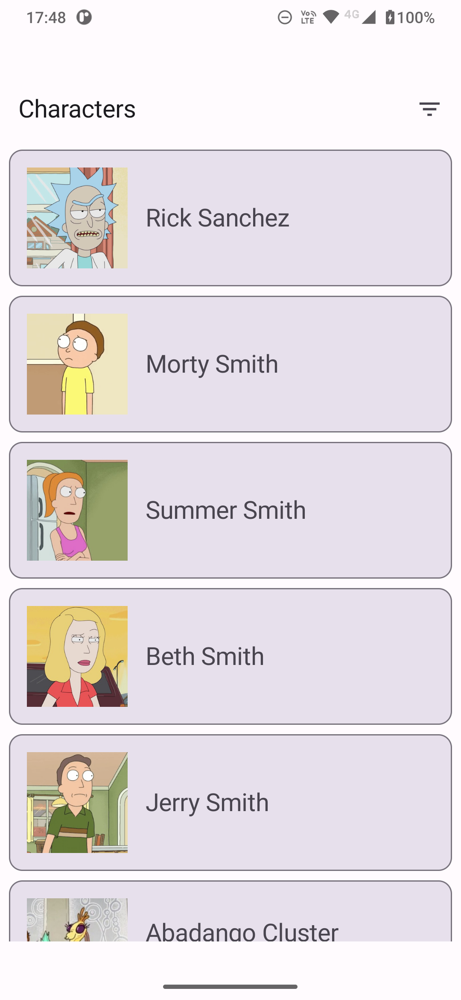
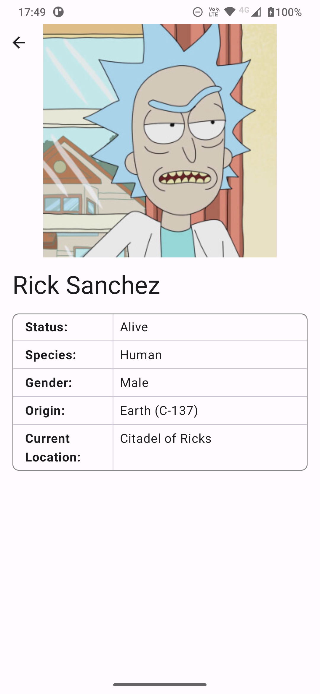
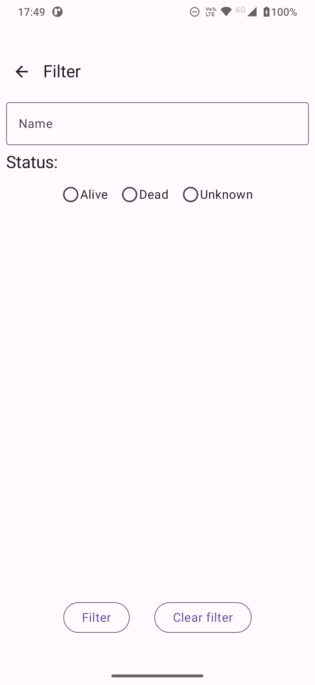

# Stone Challenge: Rick and Morty Characters

## Descrição

Desafio técnico para a Stone. Eu criei a tela com a lista de personagens (Home screen), a tela com
os detalhes do personagem (Character Details screen) e a tela de filtro (Filter screen). Eu também:

* Adicionei alguns testes (queria ter adicionado mais, mas faltou tempo)
* Modularizei o código em 4 áreas principais: app, domain, data e presentation
* Usei MVVM
* Usei KtLint
* Criei um Pull Request separado só com as mudanças mais importantes (então ignorando coisas como
  AndroidManifest, gradle, drawables, configuração da injeção de dependência...)

Infelizmente não tive tempo de implementar paginação.

### Tecnologias

* Jetpack Compose para a interface do usuário UI (+ ViewModel + Flow + Navigation + Material Design)
* Koin para injeção de dependências
* Retrofit + Kotlin Serialization + Kotlin Coroutines para API
* JUnit + MockK + Espresso para testes

## Screenshots

| Home                                 | Details                                              | Filter                                   |
|--------------------------------------|------------------------------------------------------|------------------------------------------|
|  |  |  |
